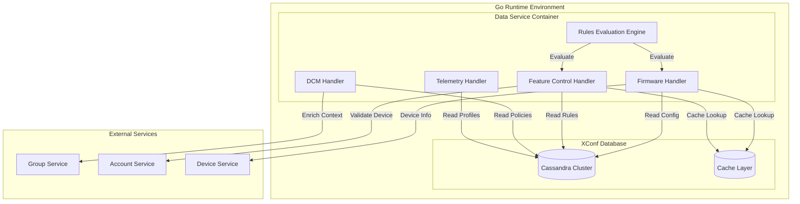
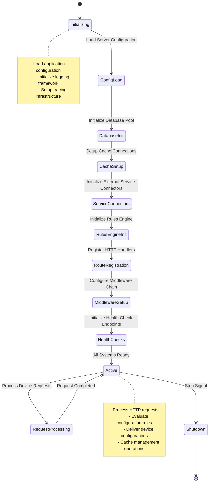
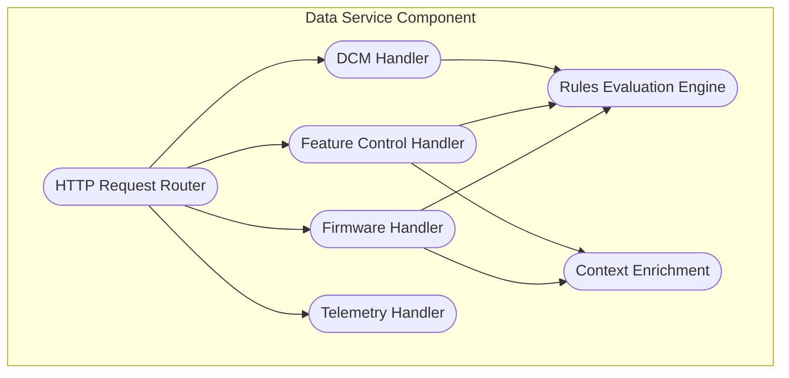
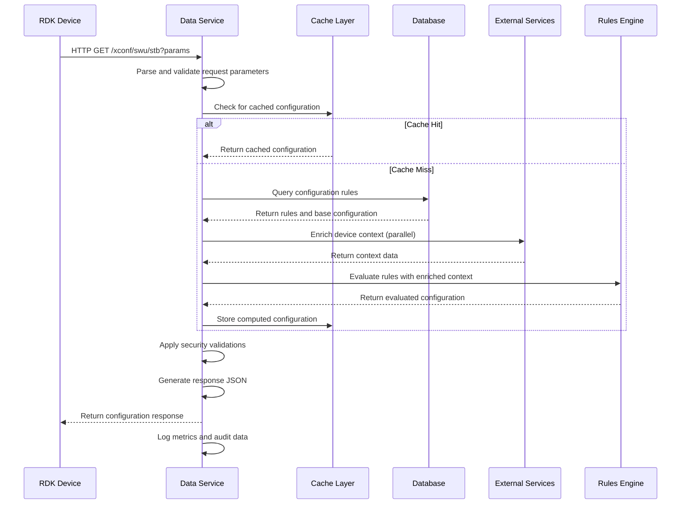
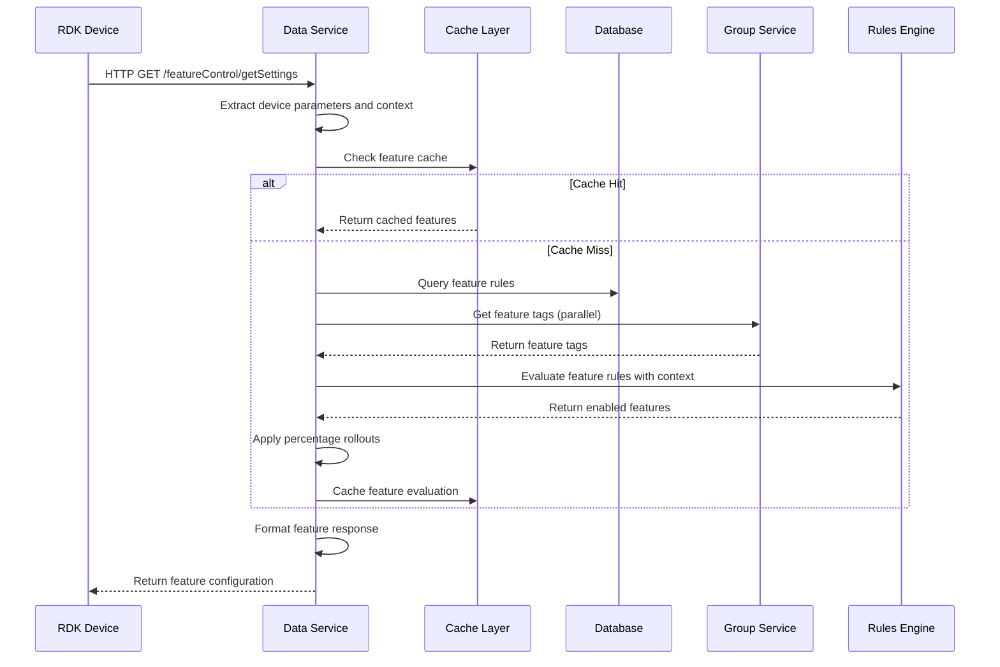

# XConf Data Service Component Documentation

The XConf Data Service is the core component of the XConf WebConfig system that provides high-performance configuration delivery to RDK devices. It serves as the primary interface between RDK devices and the XConf configuration management ecosystem, delivering firmware configurations, feature control settings, device control management (DCM) policies, and telemetry profiles based on sophisticated rule evaluation engines.

The Data Service integrates seamlessly with the XConf Admin service to consume configuration policies and rules, then evaluates these rules in real-time against device requests to deliver personalized configuration responses. It serves as the critical path for all device configuration operations in large-scale RDK deployments.

**Key Features & Responsibilities**:

- **High-Performance Configuration Delivery**: Optimized request processing with caching and rule evaluation for minimal latency
- **Firmware Management**: Determines appropriate firmware versions and download locations based on device characteristics and deployment rules
- **Feature Control Service (RFC)**: Delivers feature flag configurations with percentage-based rollouts and conditional targeting
- **Device Control Manager (DCM) Integration**: Provides DCM settings including log upload policies and device-specific configurations
- **Telemetry Profile Management**: Delivers telemetry collection profiles and data upload configurations
- **Rule-Based Evaluation Engine**: Real-time evaluation of complex conditional logic for targeted configuration delivery
- **Multi-Protocol Support**: Supports HTTP, HTTPS, and TFTP protocols for firmware distribution
- **Security and Validation**: Comprehensive request validation, authentication, and device verification

## Design

The XConf Data Service follows a high-performance, stateless architecture optimized for handling thousands of concurrent device requests. The design emphasizes speed and reliability through multi-level caching, efficient rule evaluation engines, and database connection pooling. The service implements a request-response pattern with sophisticated context enrichment from external services including group services, account management, and device tagging systems.

The architecture prioritizes horizontal scalability through stateless service design and distributed caching strategies. Security is implemented through multiple validation layers including device authentication, request sanitization, and protocol validation. The system maintains high availability through health check endpoints, circuit breaker patterns, and graceful degradation when external dependencies are unavailable.

### Prerequisites and Dependencies

**MUST Requirements:**
- XConf WebConfig database backend (supporting device configuration tables, rules, and cached data)
- Go 1.19+ runtime environment with comprehensive standard library support
- Cassandra database cluster for persistent configuration storage
- HTTP server infrastructure with Gorilla Mux routing and middleware support
- Rules engine supporting complex conditional logic evaluation with high-performance execution

**SHOULD Requirements:**
- Redis or equivalent high-performance caching layer for configuration and rule caching
- External service integrations (Group Service, Account Service, Device Service) for context enrichment
- Metrics collection infrastructure (Prometheus) for operational observability
- Distributed tracing system (OpenTelemetry) for request flow analysis
- Load balancer infrastructure for high-availability deployments

**Dependent Components:**
- RDK-B and RDK-V devices depend on Data Service for all configuration operations
- XConf Admin service provides configuration rules and policies consumed by Data Service
- External monitoring and analytics systems consume Data Service metrics and logs
- Content Delivery Networks (CDN) work with Data Service for firmware distribution



## Component State Flow

### Initialization to Active State

The Data Service initializes through a comprehensive startup sequence including database connection establishment, cache layer initialization, external service connector setup, and rules engine preparation. The system registers all HTTP route handlers and establishes middleware chains for authentication, logging, and metrics collection.



### Runtime State Changes and Context Switching

The Data Service maintains high-performance operation through efficient context switching during request processing. Context enrichment occurs through parallel external service calls, rule evaluation happens in isolated execution contexts, and response generation uses optimized serialization pipelines.

**State Change Triggers:**
- Device request processing triggers context creation and rule evaluation workflows
- Cache miss events cause database query execution and cache population operations
- External service timeouts trigger circuit breaker activation and fallback response generation
- Configuration rule updates cause cache invalidation and rule engine recompilation

**Context Switching Scenarios:**
- Application type context isolation ensures proper configuration separation between STB and RDKV devices
- Feature flag evaluation context maintains state for percentage-based rollout calculations
- Security context switching validates device authentication and request authorization

## Internal Modules

The Data Service is organized into specialized handler modules, each optimized for specific configuration domain processing with shared infrastructure for caching, validation, and response generation.

| Module/Class | Description | Key Files |
|-------------|------------|-----------|
| **Firmware Handler** | Processes firmware configuration requests with rule evaluation and download location determination | `estb_firmware_handler.go`, `estb_firmware_context.go` |
| **Feature Control Handler** | Manages feature flag requests with percentage rollouts and conditional targeting | `feature_control_handler.go`, `feature_control_context.go` |
| **DCM Handler** | Delivers device control management settings including log upload policies | `log_uploader_handler.go`, `log_uploader_context.go` |
| **Telemetry Handler** | Provides telemetry profile configurations for data collection | `dataapi/dcm/telemetry/*.go` |
| **Rules Engine** | High-performance rule evaluation engine for conditional logic processing | `rulesengine/*.go` |
| **Context Enrichment** | External service integration for device context and feature tag resolution | `dataapi_common.go` |



## API Endpoints

### Firmware Configuration API

**Base Path**: `/xconf/swu/{applicationType}`

#### Get Firmware Configuration
Retrieves firmware configuration for RDK devices based on device characteristics and deployment rules.

**Endpoint**: `GET /xconf/swu/{applicationType}`

**Parameters**:
- `{applicationType}`: Device application type (`stb`, `rdkv`)
- Query parameters: Device-specific attributes (MAC address, model, environment, etc.)

**Request Example**:
```http
GET /xconf/swu/stb?eStbMac=AA:BB:CC:DD:EE:FF&model=MODEL_X&env=PROD&version=1.0.0
Host: xconf-dataservice.example.com
User-Agent: RDK-Device/1.0
```

**Response Example**:
```json
{
  "firmwareVersion": "2.1.0-PROD",
  "firmwareFilename": "firmware-2.1.0-PROD.bin",
  "firmwareDownloadURL": "https://cdn.example.com/firmware/firmware-2.1.0-PROD.bin",
  "firmwareLocation": "cdn.example.com",
  "ipv6FirmwareLocation": "2001:db8::1",
  "firmwareDownloadProtocol": "http",
  "rebootImmediately": false,
  "forceHttp": false,
  "upgradeDelay": 0,
  "mandatoryUpdate": false
}
```

**Response Codes**:
- `200 OK`: Configuration successfully retrieved
- `404 Not Found`: No configuration found for device
- `400 Bad Request`: Invalid device parameters
- `500 Internal Server Error`: Service error

---

### Feature Control API (RFC)

**Base Path**: `/featureControl/getSettings/{applicationType}`

#### Get Feature Control Settings
Retrieves feature flag configurations with conditional targeting and percentage-based rollouts.

**Endpoint**: `GET /featureControl/getSettings/{applicationType}`

**Parameters**:
- `{applicationType}`: Device application type (optional)
- Query parameters: Device context for feature evaluation

**Request Example**:
```http
GET /featureControl/getSettings/stb?eStbMac=AA:BB:CC:DD:EE:FF&model=MODEL_X&partnerId=PARTNER_1
Host: xconf-dataservice.example.com
User-Agent: RDK-Device/1.0
```

**Response Example**:
```json
{
  "featureControl": {
    "features": [
      {
        "name": "ENABLE_NEW_UI",
        "featureInstance": "ENABLE_NEW_UI_INSTANCE",
        "enable": true,
        "configData": {
          "ui_theme": "dark",
          "animation_enabled": true
        },
        "applicationType": "stb"
      },
      {
        "name": "VIDEO_OPTIMIZATION",
        "featureInstance": "VIDEO_OPT_INSTANCE",
        "enable": false,
        "configData": {
          "optimization_level": "standard"
        },
        "applicationType": "stb"
      }
    ]
  },
  "effectiveImmediate": false
}
```

**Response Codes**:
- `200 OK`: Feature settings successfully retrieved
- `404 Not Found`: No feature settings found
- `400 Bad Request`: Invalid request parameters
- `500 Internal Server Error`: Service error

---

### Device Control Manager (DCM) API

**Base Path**: `/loguploader/getSettings/{applicationType}`

#### Get DCM Settings
Retrieves device control management settings including log upload policies and device configurations.

**Endpoint**: `GET /loguploader/getSettings/{applicationType}`

**Parameters**:
- `{applicationType}`: Device application type (optional)
- `settingType`: Specific setting types to retrieve (optional)

**Request Example**:
```http
GET /loguploader/getSettings/stb?eStbMac=AA:BB:CC:DD:EE:FF&settingType=LogUpload&settingType=DeviceSettings
Host: xconf-dataservice.example.com
User-Agent: RDK-Device/1.0
```

**Response Example**:
```json
{
  "urn:settings:LogUpload": {
    "Name": "LogUploadSettings_STB",
    "NumberOfDays": 3,
    "AreSettingsActive": true,
    "LogUploadSettings": {
      "MocaLogPeriod": 1,
      "WifiLogPeriod": 1,
      "UploadRepositoryName": "LOG_UPLOAD_REPO",
      "UploadOnReboot": true,
      "UploadRepositoryURL": "https://logs.example.com/upload",
      "NumberOfDays": 3,
      "UploadRepositoryUploadProtocol": "HTTP",
      "LogsUploadFrequency": 1440
    }
  },
  "urn:settings:DeviceSettings": {
    "Name": "DeviceSettings_STB",
    "CheckOnReboot": true,
    "SettingsAreActive": true,
    "Schedule": {
      "TimeZone": "UTC",
      "DurationMinutes": 30,
      "StartDate": "2025-01-01",
      "EndDate": "2025-12-31"
    },
    "ConfigurationServiceURL": "https://config.example.com/api"
  }
}
```

**Response Codes**:
- `200 OK`: DCM settings successfully retrieved
- `404 Not Found`: No DCM settings found
- `400 Bad Request`: Invalid request parameters
- `500 Internal Server Error`: Service error

---

### Telemetry API

**Base Path**: `/loguploader/getTelemetryProfiles/{applicationType}`

#### Get Telemetry Profiles
Retrieves telemetry configuration profiles for data collection and reporting.

**Endpoint**: `GET /loguploader/getTelemetryProfiles/{applicationType}`

**Parameters**:
- `{applicationType}`: Device application type (optional)
- Query parameters: Device context for profile selection

**Request Example**:
```http
GET /loguploader/getTelemetryProfiles/stb?eStbMac=AA:BB:CC:DD:EE:FF&model=MODEL_X
Host: xconf-dataservice.example.com
User-Agent: RDK-Device/1.0
```

**Response Example**:
```json
{
  "profiles": [
    {
      "name": "BASIC_TELEMETRY",
      "description": "Basic telemetry collection profile",
      "schedule": {
        "type": "ActNow",
        "expression": "*/15 * * * *"
      },
      "uploadRepository": {
        "name": "TELEMETRY_REPO",
        "url": "https://telemetry.example.com/upload",
        "protocol": "HTTP"
      },
      "telemetryProfile": [
        {
          "header": "SYSTEM_METRICS",
          "content": "CPU_Usage,Memory_Usage,Disk_Usage",
          "type": "2",
          "pollingFrequency": "300"
        },
        {
          "header": "NETWORK_METRICS", 
          "content": "Bandwidth_Usage,Packet_Loss",
          "type": "2",
          "pollingFrequency": "60"
        }
      ]
    }
  ]
}
```

**Response Codes**:
- `200 OK`: Telemetry profiles successfully retrieved
- `404 Not Found`: No telemetry profiles found
- `400 Bad Request`: Invalid request parameters
- `500 Internal Server Error`: Service error

---

### Firmware Version Check API

**Base Path**: `/estbfirmware/checkMinimumFirmware`

#### Check Minimum Firmware Version
Validates if device firmware meets minimum version requirements.

**Endpoint**: `GET /estbfirmware/checkMinimumFirmware`

**Request Example**:
```http
GET /estbfirmware/checkMinimumFirmware?eStbMac=AA:BB:CC:DD:EE:FF&firmwareVersion=1.5.0&model=MODEL_X
Host: xconf-dataservice.example.com
User-Agent: RDK-Device/1.0
```

**Response Example**:
```json
{
  "requiredVersion": "2.0.0",
  "explanation": "Your firmware version 1.5.0 is below the minimum required version 2.0.0",
  "firmwareVersions": ["2.0.0", "2.1.0", "2.2.0"]
}
```

---

### Diagnostic and Health Check APIs

**Base Path**: `/info`

#### Refresh All Cached Data
**Endpoint**: `GET /info/refreshAll`

Forces refresh of all cached configuration data.

#### Refresh Specific Table Cache
**Endpoint**: `GET /info/refresh/{tableName}`

Forces refresh of specific table cache data.

#### Get System Statistics
**Endpoint**: `GET /info/statistics`

Retrieves system performance and operational statistics.

**Response Example**:
```json
{
  "cacheStats": {
    "hitRate": 0.95,
    "missRate": 0.05,
    "evictionCount": 1234,
    "totalCacheSize": "512MB"
  },
  "requestStats": {
    "totalRequests": 1000000,
    "averageResponseTime": "45ms",
    "errorRate": 0.001
  },
  "databaseStats": {
    "connectionPoolSize": 20,
    "activeConnections": 12,
    "avgQueryTime": "15ms"
  }
}
```

## Request Processing Flow

### Device Configuration Request Processing



### Feature Control Request Processing



## Configuration Rule Evaluation

The Data Service implements a sophisticated rules engine that evaluates configuration policies in real-time based on device characteristics and deployment contexts.

### Rule Types and Evaluation Order

1. **Priority-Based Rules**: Higher priority rules override lower priority rules
2. **Conditional Logic**: Complex boolean expressions with AND/OR operators
3. **Percentage Rollouts**: Statistical distribution for gradual deployments
4. **Time-Based Rules**: Temporal activation and expiration conditions
5. **Geographic Rules**: Location-based configuration targeting
6. **Device Cohort Rules**: Model, firmware version, and capability-based targeting

### Rule Evaluation Context

The rules engine maintains rich context information for accurate evaluation:

```go
type EvaluationContext struct {
    DeviceMAC          string
    Model              string
    Environment        string
    FirmwareVersion    string
    PartnerId          string
    AccountId          string
    Capabilities       []string
    GeographicLocation string
    TimeZone           string
    FeatureTags        map[string]string
    GroupMemberships   []string
}
```

### Performance Optimizations

- **Rule Compilation**: Rules are pre-compiled into optimized evaluation trees
- **Context Caching**: Device context is cached to reduce external service calls
- **Parallel Evaluation**: Independent rule sets are evaluated concurrently
- **Short-Circuit Logic**: Evaluation stops early when definitive results are reached
- **Cache Warming**: Popular configurations are pre-computed and cached

## Security Model

### Request Validation
- **Parameter Sanitization**: All input parameters are validated and sanitized
- **MAC Address Validation**: Device MAC addresses are verified for format and authenticity
- **Protocol Validation**: Request protocols and headers are validated against expected patterns
- **Rate Limiting**: Requests are rate-limited per device and IP address to prevent abuse

### Device Authentication
- **Certificate-Based**: X.509 certificate validation for device identity
- **MAC Address Verification**: Cross-reference with authorized device databases
- **Capability Validation**: Device-reported capabilities are validated against known models
- **Anti-Spoofing**: Multiple validation layers prevent device identity spoofing

### Response Security
- **Content Sanitization**: All response content is sanitized to prevent injection attacks
- **HTTPS Enforcement**: Secure transport layer encryption for sensitive configuration data
- **Response Signing**: Critical responses can be cryptographically signed for integrity
- **Audit Logging**: Complete audit trail for all configuration deliveries

## Performance Characteristics

### Scalability Metrics
- **Request Throughput**: Designed to handle 10,000+ requests per second per instance
- **Response Latency**: Sub-100ms response times for cached configurations
- **Concurrent Connections**: Support for 1,000+ concurrent device connections
- **Memory Efficiency**: Optimized memory usage with configurable cache limits

### Caching Strategy
- **Multi-Level Caching**: In-memory, Redis, and database-level caching
- **Cache Invalidation**: Intelligent cache invalidation based on configuration changes
- **Cache Warming**: Proactive cache population for popular configurations
- **Cache Partitioning**: Separate cache spaces for different configuration types

### Database Optimization
- **Connection Pooling**: Efficient database connection management
- **Query Optimization**: Optimized queries with proper indexing strategies
- **Read Replicas**: Read operations distributed across database replicas
- **Batch Operations**: Bulk operations for improved throughput

## Monitoring and Observability

### Metrics Collection
The Data Service exposes comprehensive metrics for operational monitoring:

- **Request Metrics**: Request count, response times, error rates per endpoint
- **Cache Metrics**: Hit rates, miss rates, eviction counts, cache sizes
- **Database Metrics**: Query times, connection pool usage, error rates
- **External Service Metrics**: Response times and error rates for external dependencies
- **Business Metrics**: Configuration delivery success rates, feature activation rates

### Health Checks
- **Liveness Probe**: Confirms service is running and accepting requests
- **Readiness Probe**: Validates all dependencies are available and healthy
- **Deep Health Check**: Comprehensive validation of all system components
- **Dependency Health**: Monitors health of external service dependencies

### Distributed Tracing
- **Request Tracing**: Complete request flow tracing across all components
- **Context Propagation**: Trace context propagated to external service calls
- **Performance Analysis**: Detailed timing analysis for performance optimization
- **Error Correlation**: Error tracking and correlation across service boundaries

## Deployment Considerations

### High Availability Setup
- **Load Balancer Configuration**: Multiple service instances behind load balancers
- **Health Check Integration**: Load balancer health check configuration
- **Graceful Shutdown**: Proper connection draining during deployments
- **Circuit Breaker Pattern**: Fail-fast behavior when dependencies are unavailable

### Scaling Strategies
- **Horizontal Scaling**: Add more service instances to handle increased load
- **Database Scaling**: Scale database reads through replica distribution
- **Cache Scaling**: Distribute cache load across multiple Redis instances
- **Geographic Distribution**: Deploy instances closer to device populations

### Configuration Management
- **Environment Separation**: Separate configurations for dev, staging, and production
- **Feature Flags**: Runtime feature toggling for safe deployments
- **Configuration Validation**: Automated validation of configuration changes
- **Rollback Procedures**: Quick rollback capabilities for problematic deployments

This comprehensive documentation provides complete coverage of the XConf Data Service API, architecture, and operational characteristics. The service serves as the critical high-performance component for delivering configuration data to RDK devices at scale, with robust security, caching, and monitoring capabilities.